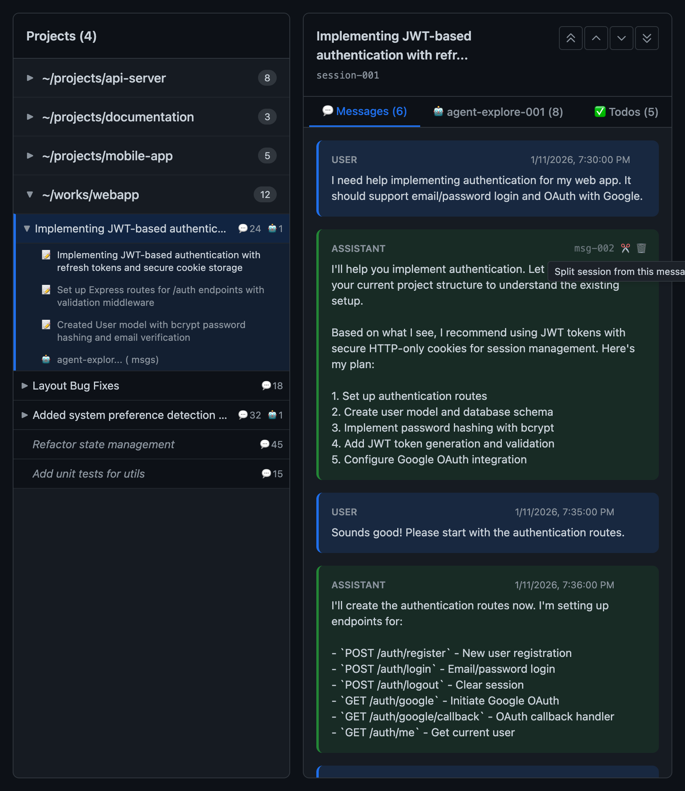

# claude-code-sessions

Monorepo for Claude Code session management tools

## Packages

| Package                                | npm                     | Description  |
| -------------------------------------- | ----------------------- | ------------ |
| [@claude-sessions/core](packages/core) | `@claude-sessions/core` | Core library |
| [@claude-sessions/web](packages/web)   | `@claude-sessions/web`  | Web UI       |
| [claude-sessions-mcp](packages/mcp)    | `claude-sessions-mcp`   | MCP server   |

## Installation

### MCP Server

```bash
# Add to Claude Code
claude mcp add claude-sessions -- npx claude-sessions-mcp
```

Or add directly to `~/.claude.json`:

```json
{
  "mcpServers": {
    "claude-sessions": {
      "command": "npx",
      "args": ["claude-sessions-mcp"]
    }
  }
}
```

### Web UI (standalone)

```bash
npx @claude-sessions/web --port 5173
```

## Development

```bash
# Install dependencies
corepack enable
pnpm install

# Dev server
pnpm dev           # Web UI
pnpm dev:mcp       # MCP server

# Build
pnpm build         # All packages
pnpm build:core    # core only
pnpm build:mcp     # mcp only
pnpm build:web     # web only
```

## Screenshot

### Web UI



### VSCode Extension


## Features

- **Project listing**: Browse Claude Code project folders
- **Session management**: List, rename, delete sessions
- **Message management**: View and delete messages within sessions
- **Cleanup**: Remove empty sessions and invalid API key messages
- **Web UI**: SvelteKit-based web interface

## MCP Tools

| Tool                | Description                               |
| ------------------- | ----------------------------------------- |
| `list_projects`     | List Claude Code projects                 |
| `list_sessions`     | List sessions in a project                |
| `rename_session`    | Rename a session                          |
| `delete_session`    | Delete session (moves to backup folder)   |
| `delete_message`    | Delete message and repair UUID chain      |
| `preview_cleanup`   | Preview sessions to be cleaned            |
| `clear_sessions`    | Clear empty sessions and invalid messages |
| `get_session_files` | Get files changed in a session            |
| `split_session`     | Split session at a specific message       |
| `start_gui`         | Start Web UI                              |
| `stop_gui`          | Stop Web UI                               |

## Tech Stack

- **Core**: TypeScript + Effect-TS
- **MCP Server**: @modelcontextprotocol/sdk
- **Web UI**: SvelteKit + Svelte 5 + TailwindCSS
- **Build**: tsup + Vite
- **Package Manager**: pnpm (monorepo)

## License

MIT
