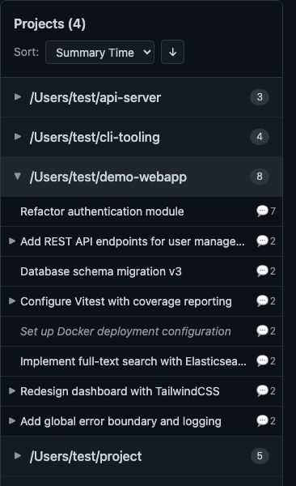
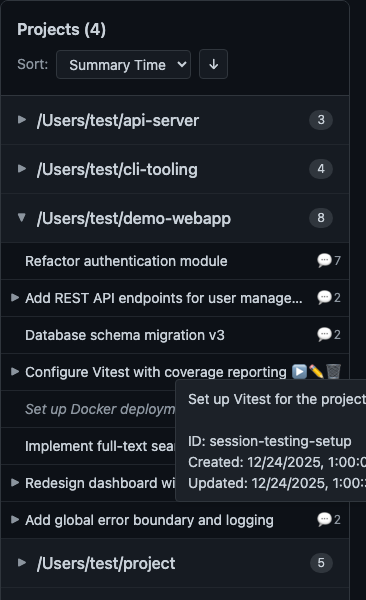
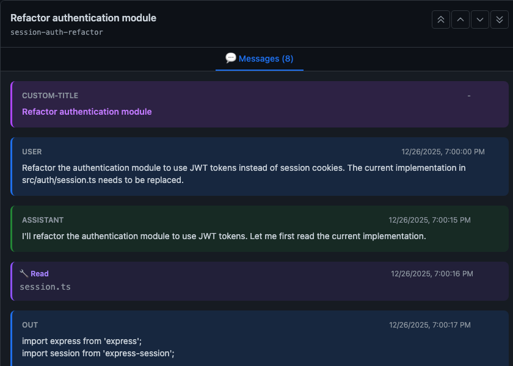
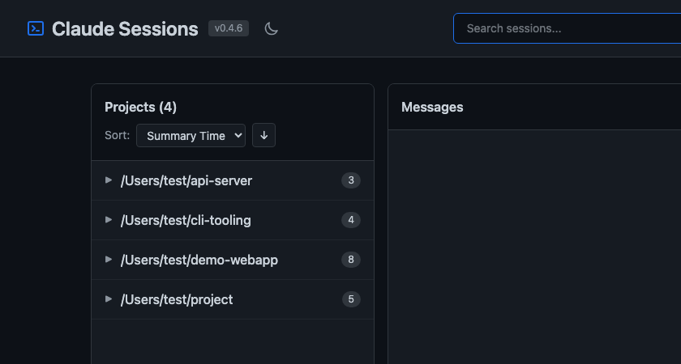
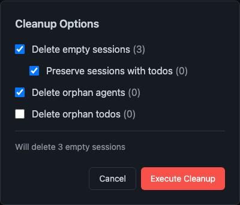
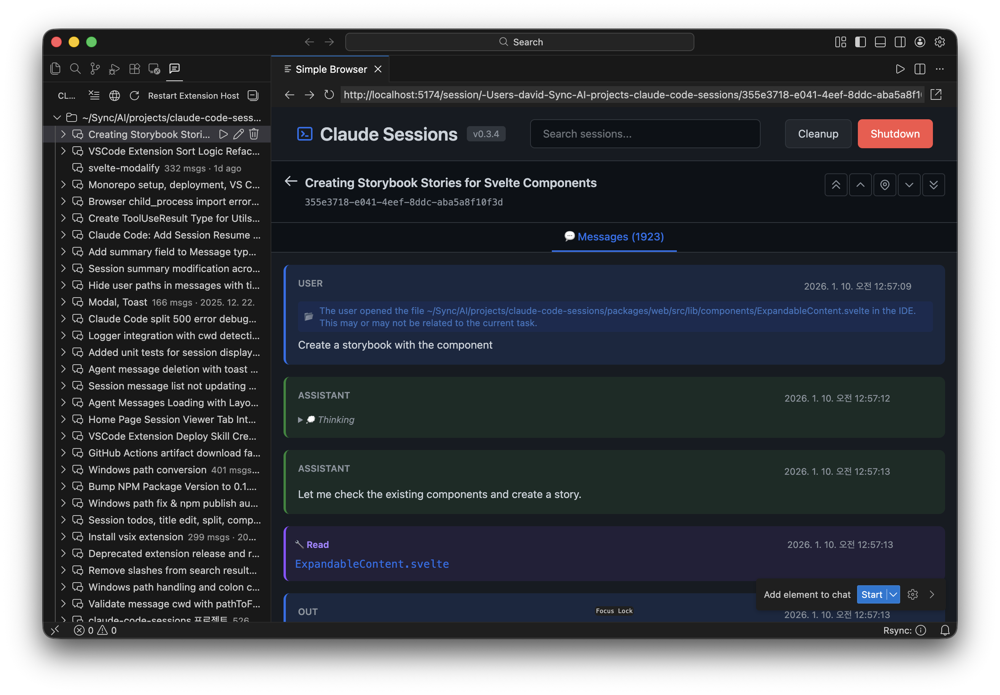
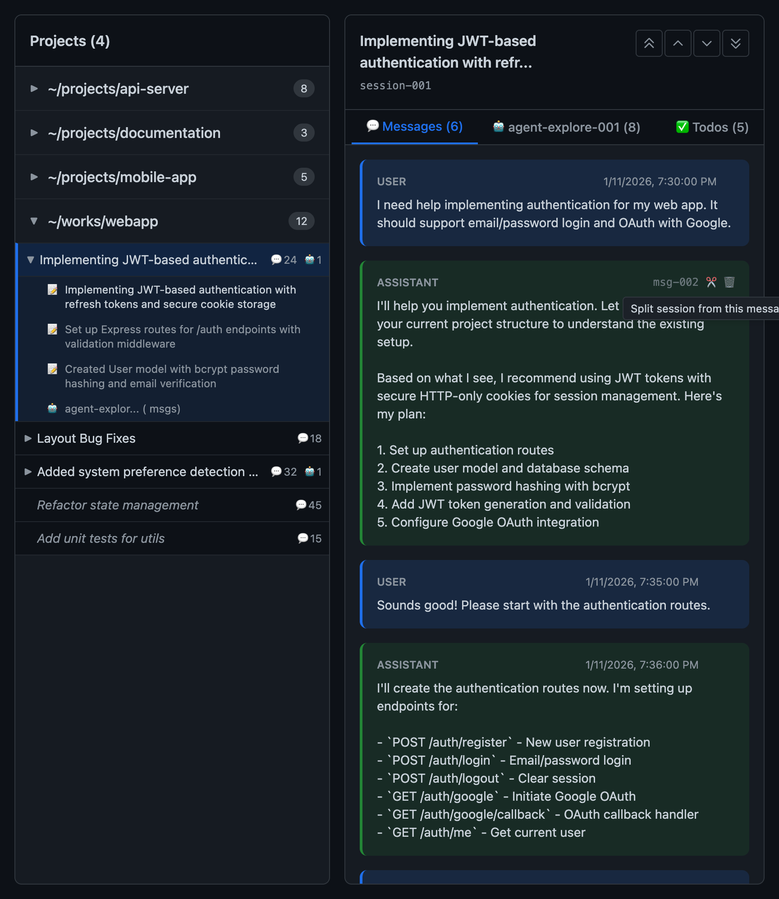

# claude-code-sessions

[](LICENSE)


Browse, search, rename, split, and clean up [Claude Code](https://claude.ai/code) sessions — via MCP server, Web UI, or VSCode extension.

> **Note**: This is a community project and is not affiliated with or endorsed by Anthropic.

## Packages

| Package                                      | Version                                                                                                                                                                                                                                                                                                  | Description      |
| -------------------------------------------- | -------------------------------------------------------------------------------------------------------------------------------------------------------------------------------------------------------------------------------------------------------------------------------------------------------- | ---------------- |
| [@claude-sessions/core](packages/core)       | [](https://www.npmjs.com/package/@claude-sessions/core)                                                                                                                                                                                        | Core library     |
| [@claude-sessions/web](packages/web)         | [](https://www.npmjs.com/package/@claude-sessions/web)                                                                                                                                                                                          | Web UI           |
| [claude-sessions-mcp](packages/mcp)          | [](https://www.npmjs.com/package/claude-sessions-mcp)                                                                                                                                                                                            | MCP server       |
| [claude-sessions](packages/vscode-extension) | [](https://marketplace.visualstudio.com/items?itemName=es6kr.claude-sessions)<br>[](https://open-vsx.org/extension/es6kr/claude-sessions) | VSCode extension |

## Installation

### Stable (`@latest`)

```bash
# MCP Server
claude mcp add claude-sessions -- npx claude-sessions-mcp

# Web UI
npx @claude-sessions/web
```

Or add MCP server directly to `~/.claude.json`:

```json
{
  "mcpServers": {
    "claude-sessions": {
      "command": "npx",
      "args": ["claude-sessions-mcp"]
    }
  }
}
```

### Beta (`@beta`)

```bash
# MCP Server
claude mcp add claude-sessions -- npx claude-sessions-mcp@beta

# Web UI
npx @claude-sessions/web@beta
```

Or add MCP server directly to `~/.claude.json`:

```json
{
  "mcpServers": {
    "claude-sessions": {
      "command": "npx",
      "args": ["claude-sessions-mcp@beta"]
    }
  }
}
```

## Development

```bash
# Install dependencies
corepack enable
pnpm install

# Dev server
pnpm dev           # Web UI
pnpm dev:mcp       # MCP server

# Build
pnpm build         # All packages
pnpm build:core    # core only
pnpm build:mcp     # mcp only
pnpm build:web     # web only
```

## Features

### Project Listing

Browse Claude Code project folders with expandable tree view, sorted by summary time or name.



### Session Management

List, rename, delete, and split sessions. Hover to see session details with tooltip.



### Message Viewer

View messages with tab interface. Inspect user/assistant turns, tool calls, and thinking blocks.



### Search

Search sessions by title across all projects.



### Cleanup

Remove empty sessions, orphan agents, and orphan todos with preview before execution.



### VSCode Extension



### Web UI



## MCP Tools

| Tool                | Description                               |
| ------------------- | ----------------------------------------- |
| `list_projects`     | List Claude Code projects                 |
| `list_sessions`     | List sessions in a project                |
| `rename_session`    | Rename a session                          |
| `delete_session`    | Delete session (moves to backup folder)   |
| `delete_message`    | Delete message and repair UUID chain      |
| `preview_cleanup`   | Preview sessions to be cleaned            |
| `clear_sessions`    | Clear empty sessions and invalid messages |
| `get_session_files` | Get files changed in a session            |
| `split_session`     | Split session at a specific message       |
| `start_gui`         | Start Web UI                              |
| `stop_gui`          | Stop Web UI                               |

## Tech Stack

- **Core**: TypeScript + Effect-TS
- **MCP Server**: @modelcontextprotocol/sdk
- **Web UI**: SvelteKit + Svelte 5 + TailwindCSS
- **Build**: tsup + Vite
- **Package Manager**: pnpm (monorepo)

## License

MIT
